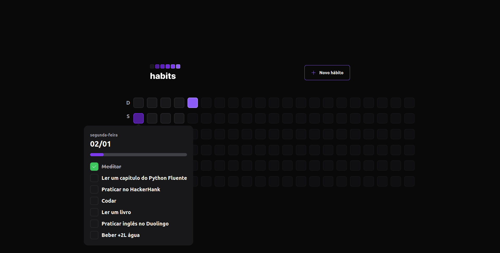
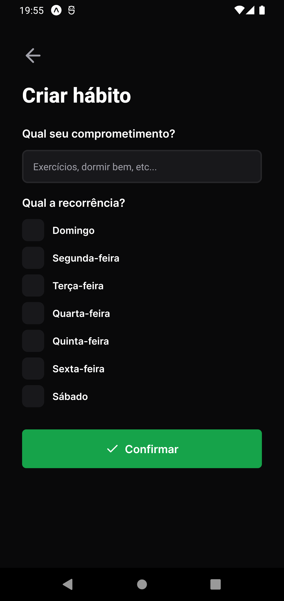
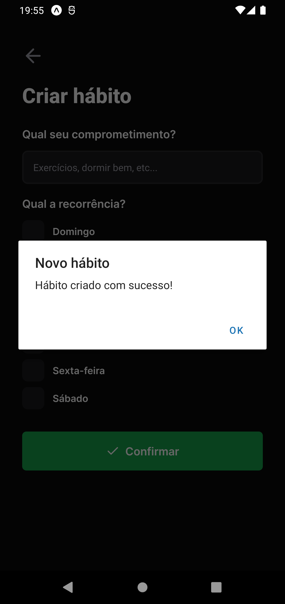

<p align="center">
  
</p>
<h3 align="center">
You are in control of your routine!
</h3>
<br>

<p align="center">
  <a href="#habits">Habits</a> •
  <a href="#Instalação">Installation</a> •
  <a href="#Technologies">Technologies</a> •
  <a href="#Author">Author</a>
</p>


## Habits

Habits is a daily task tracking app to help its users track their completed and unfulfilled activities.

The application flow is simple: the user registers the desired habits indicating which days of the week they should be performed and every day he will have a list of habits according to the current day, where he will indicate the status of each habit and the application will generate a daily progress that will be illustrated in the progress bar and also in the colors of the squares that represent the days where lighter colors represent greater numbers of complete habits.

The application has, in addition to the backend, a web and mobile application, which will be illustrated below.

### Habits - web app

When accessing the home of the web application, the user will see the page below where a button to register a new habit and several squares will be displayed, which represent past days, current day and future day. As we can see below, each day has a different color, where:

- Gray indicates that no habits were performed.
- Darker colors indicate little progress in daily habits.
- Lighter colors indicate much progress in daily habits.
- Gray with reduced opacity indicates future days and are not clickable.


When clicking on the `New habit` button, the modal below will be displayed for the user to enter a title and the days of the week in which the new habit should be performed:


By clicking on one of the days, its information will be displayed, for example: its numerical date, the day of the week, the progress bar and the list of habits that must be carried out on the respective day of the week, as shown in the image below:



Note that the day square above is darker than the one in the following image. This is due to the fact that on the day below the percentage of completed habits was higher:


With that, we know all the flows of the web interface when using the application. I leave below a GIF demonstrating the application being used where I go through all the features mentioned above:


### Habits - mobile application

The functionalities of the mobile application are the same as those of the web, so I will show the screens with less explanation to avoid redundancy and I will pay attention only to small details if they exist and are relevant to be mentioned.

Just like on the web, when accessing the application, the user will come across the 'little squares' that represent the days with colors based on their respective progress, as seen below:

|                           Splash Screen                           |                              Home empty                               |                       home with progress                        |
| :---------------------------------------------------------------: | :-------------------------------------------------------------------: | :-------------------------------------------------------------: |
|  |  |  |

Unlike the web, when clicking on a day to see the details, we will not have a popover with its details, but a redirection to a screen where this information will be displayed. Next, we will see the screens where we have a day without linked habits, a day with partially completed habits and a fully completed day, respectively:

|                               day without habits                                |                            day partially concluded                            |                           day totally concluded                            |
| :--------------------------------------------------------------------------: | :------------------------------------------------------------------------------: | :---------------------------------------------------------------------------: |
|  |  |  |

On the Home screen and on the day screen without habits, we have a button and a link, respectively, which will direct us to the form for creating a new habit.
The necessary information is the same as on the web and below is the illustrated registration flow:

|                                 empty form                                 |                           form completed                            |                               completed registration                               |
| :------------------------------------------------------------------------: | :------------------------------------------------------------------: | :----------------------------------------------------------------------------: |
|  |  |  |

With that, we conclude our tour of the mobile application! 🙂
Just like on the web, I leave below a GIF navigating through the application and going through all its flows and also the demonstration of the animations present in the App:


## installation

Before starting, you will need to have the following tools installed on your machine:
[Git](https://git-scm.com), [Node.js](https://nodejs.org/en/).
Also it's nice to have an editor to work with the code like [VSCode](https://code.visualstudio.com/).

> ⚠ Before running the frontend and mobile check the IP of your machine and configure it in the axios setup file present in the lib folder of the respective projects

### 🎲 Running the Back End (server)

```bash
# Clone this repository
$ git clone git@github.com:MrRioja/nlw-setup.git

# Access project folder in terminal/cmd
$ cd nlw-setup

# Go to server folder
$ cd server

# install the dependencies
$ npm install
# If you prefer to use Yarn, run the command below
$ yarn

# Run the application in development mode
$ npm run dev
# If you prefer to use Yarn, run the command below
$ yarn dev

# The server will start on port 3333 - go to <http://localhost:3333>
```

### 🖥️ Rodando o Front End (Web)

```bash
# Clone this repository
$ git clone git@github.com:MrRioja/nlw-setup.git

# Access project folder in terminal/cmd
$ cd nlw-setup

# Go to web folder
$ cd web

# install the dependencies
$ npm install
# If you prefer to use Yarn, run the command below
$ yarn

# Run the application in development mode
$ npm run dev
# If you prefer to use Yarn, run the command below
$ yarn dev

# The server will start on port 5173 - go to <http://localhost:5173>
```

### 📱 Running the App (Mobile)

```bash
# Clone this repository
$ git clone git@github.com:MrRioja/nlw-setup.git

# Access project folder in terminal/cmd
$ cd nlw-setup

# Go to mobile folder
$ cd mobile

# install the dependencies
$ npm install
# If you prefer to use Yarn, run the command below
$ yarn

# run the application
$ yarn start

# The Expo menu will open in the terminal where you can scan the QR Code to run the app directly on your cell phone or the options to run it on the android or iOS emulator
```

## Technologies

[](https://skillicons.dev)